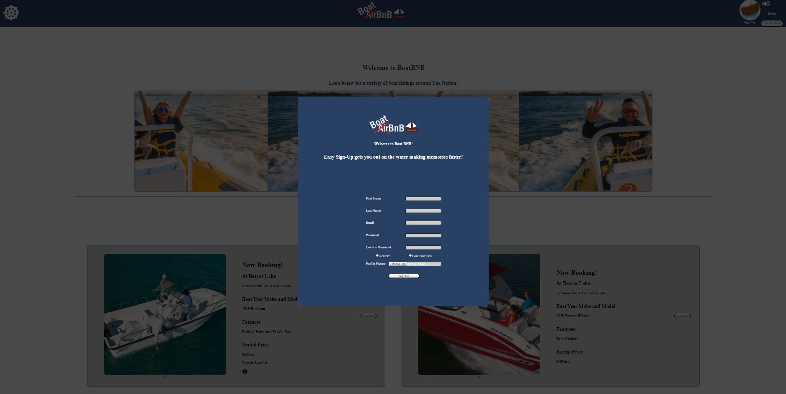

# BoatBNB

BoatBNB Live Link: https://boat-bnb.herokuapp.com/

Git wiki: https://github.com/ChrisThreadgill/BoatBNB/wiki

### Contact

## BoatBNB

---

## BoatBNB is a clone of AirBnB with an emphasis on booking boats.

1. Users will have the option between being a renter or a provider.
2. Users will have access to book and cancel loads
3. Users Will have access to leave a rating or a review on a boat.
4. Providers will be able to book listings, make changes to their listings, and delete a listing.
5. Providers will be allowed to cancel user bookings that are booked on their boat.

## Build Instructions

---

1. Download the repo and open it.
2. Cd into backend and frontend respectively and run npm install to install all dependencies.
3. In the backend folder, create a .env file and use .env.example file as a reference.
4. Set up your postgress user, create the database, migrate and seed all.
5. In your terminal run npm start on both, backend and frontend.

## Technologies Used

---

## BoatBNB features

##

### Login and Sign-up form

### Provider Pages

### Boat Reviews

### User Profile

## Future Features

---

- Interactive schedule with disabled dates based on bookings
- User Ratings / Reviews (Coming soon!).
- Map Api to allow nearby searches for boats
- User profile editing capabilities
